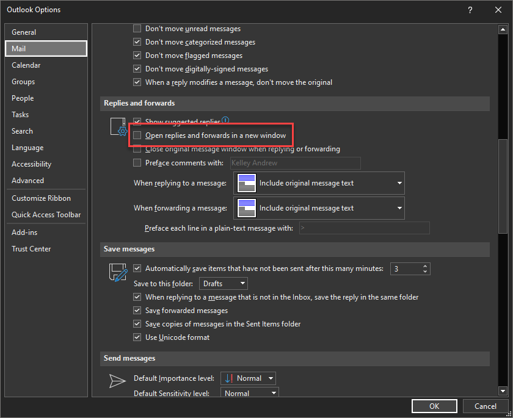

# SAP Shortcut Tool
Tool to speed up the processing of tasks in SAP

---
## A note on Outlook
Outlook does not allow programmatic access to replies that are being typed inside the main Outlook window.
You must pop-out your replies for the tool to see them.
This can be configured to happen by default in the Outlook Options

---
## Installation Instructions
1. Clone the repo onto your local harddrive.
2. Execute the Windows batch file createexe_noprompt.bat under the util directory.

---
## Functions
### Open New Ticket
This button allows for quick access to creating a new ticket, stopping at the customer selection page.
### Record Mail
This button allows the quick addition of an email to a ticket. The ticket number must be in the subject line.
### Track Time
This button opens the CAT2 transaction with the Target and Totals lines pre-selected.
### Display Ticket
This button prompts the user for a ticket number, and then quickly opens the ticket and displays the ticket chronology.
### Change Ticket
This button prompts the user for a ticket number and then quickly opens the ticket in change mode.
### MM03
This button prompts the user for a model number and then opens that model's page in MM03
### Solution
This button prompts the user for a ticket number and a solution text. The solution is then applied to the ticket and the ticket is closed.
### Ticket List
This button quickly opens the ZSUPL4 transaction with the planner groups 465 (USA) and 407 (Canada)

---
## Useful Utility
I find it useful to use [PowerToys](https://learn.microsoft.com/en-us/windows/powertoys/) to keep the main window always available on my screen.

---
## Contributions
Special thanks to Chris Hairston for his contributions to this project
